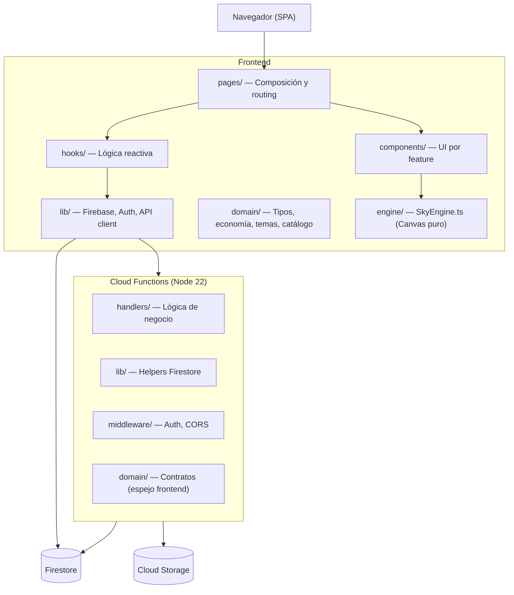

# Cielo Estrellado


Una aplicación web donde los recuerdos se convierten en estrellas.

---

## ¿Qué es Cielo Estrellado?

Cielo Estrellado es una SPA inmersiva donde los usuarios crean **cielos personalizados** llenos de estrellas. Cada estrella guarda un recuerdo: título, mensaje, imagen y año. Los cielos se comparten con otros usuarios mediante invitaciones por link, con roles diferenciados (editor / espectador). La experiencia visual es el centro: un canvas animado con paralaje, nebulosas, estrellas titilantes y estrellas fugaces.

Los usuarios acumulan **Polvo Estelar** (✦) realizando acciones — logins diarios, rachas, crear estrellas — y con ese balance desbloquean temas visuales premium para sus cielos en la tienda integrada.

---

## Demo

> Agrega aquí una captura de pantalla o GIF del cielo animado.
> Ejemplo: ``

---

## Features principales

**Cielos y estrellas**
- Crea cielos con nombre y tema visual personalizable
- Añade estrellas con título, mensaje, imagen y año del recuerdo
- Canvas animado en tiempo real con paralaje, nebulosas y efectos visuales
- Soft-delete de estrellas (recuperable)

**Compartir y colaborar**
- Invita usuarios por link (válido 7 días) con rol editor o espectador
- Gestión de miembros desde el propio cielo
- Preview de invitación pública sin necesidad de login

**Economía — Polvo Estelar (✦)**
- Gana Polvo Estelar con acciones cotidianas (login, crear estrellas, rachas)
- Tienda de temas premium con transacciones atómicas
- Historial de transacciones por usuario

**Temas visuales**
- 8 temas disponibles (1 clásico gratuito + 7 premium)
- Colores parametrizados en el engine — sin recargar, instantáneo

**Técnico**
- Reads en tiempo real via `onSnapshot` — la UI se actualiza sola
- Todos los writes pasan por Cloud Functions — seguridad y consistencia
- TypeScript strict end-to-end, frontend y backend

---

## Tech Stack

| Capa | Tecnología |
|------|-----------|
| **Frontend** | React 19, Vite 6, TypeScript strict |
| **Estilos** | Tailwind CSS v4, shadcn/ui, Magic UI, Motion (Framer Motion) |
| **Routing** | React Router v7 |
| **UI / UX** | Sonner (toasts), next-themes, lucide-react, Geist font |
| **Firebase (cliente)** | Firebase SDK v12 — Firestore, Storage, Auth |
| **Backend** | Cloud Functions v2 gen2, Node.js 22 |
| **Firebase (admin)** | Firebase Admin SDK v13 |
| **Infraestructura** | Firebase Hosting, Firestore, Cloud Storage |
| **Tests** | Vitest 4.1.1, Testing Library (frontend y functions) |

---

## Arquitectura



**Principio clave:** Los reads (cielos, estrellas, balance) van directo desde el cliente via `onSnapshot` — la UI es reactiva en tiempo real. Los writes (crear estrella, comprar tema, aceptar invitación) siempre pasan por Cloud Functions para garantizar seguridad, consistencia y atomicidad.

---

## Requisitos previos

- **Node.js** v22 o superior
- **Firebase CLI** instalado globalmente: `npm install -g firebase-tools`
- Cuenta de Firebase con un proyecto creado
- Java (para emuladores de Firestore, opcional para desarrollo local)

---

## Instalación y setup

```bash
# 1. Clonar el repositorio
git clone <url-del-repo>
cd cielo-estrellado-v3

# 2. Instalar dependencias del frontend
cd frontend && npm install && cd ..

# 3. Instalar dependencias de functions
cd functions && npm install && cd ..

# 4. Autenticarse con Firebase
firebase login

# 5. Configurar el proyecto Firebase
firebase use masmelito-f209c
# o con tu propio proyecto:
firebase use <tu-project-id>

# 6. Crear el archivo de variables de entorno del frontend
cp frontend/.env.example frontend/.env.local
# Edita .env.local con los datos de tu proyecto Firebase (ver sección siguiente)

# 7. Iniciar el servidor de desarrollo
cd frontend && npm run dev
```

---

## Variables de entorno

Crea el archivo `frontend/.env.local` con las variables de tu proyecto Firebase:

```env
VITE_FIREBASE_API_KEY=tu-api-key
VITE_FIREBASE_AUTH_DOMAIN=tu-proyecto.firebaseapp.com
VITE_FIREBASE_PROJECT_ID=tu-proyecto-id
VITE_FIREBASE_STORAGE_BUCKET=tu-proyecto.firebasestorage.app
VITE_FIREBASE_MESSAGING_SENDER_ID=tu-sender-id
VITE_FIREBASE_APP_ID=tu-app-id
```

Puedes encontrar estos valores en la consola de Firebase → Configuración del proyecto → Tus apps → SDK setup and configuration.

---

## Comandos de desarrollo

```bash
# Frontend — servidor de desarrollo (proxy /api → producción)
cd frontend && npm run dev

# Frontend — build de producción
cd frontend && npm run build

# Frontend — tests en modo watch
cd frontend && npm run test

# Frontend — tests single run (CI)
cd frontend && npm run test:run

# Functions — compilar TypeScript
cd functions && npm run build

# Functions — tests en modo watch
cd functions && npm run test

# Functions — tests single run (CI)
cd functions && npm run test:run
```

---

## Modelo de datos

| Colección | Documento | Campos principales |
|-----------|-----------|-------------------|
| `users/{uid}` | `UserRecord` | `displayName`, `email`, `stardustBalance`, `streakCount`, `lastLoginDate`, `skyLimit` |
| `users/{uid}/inventory/{itemId}` | `InventoryItem` | `itemId`, `type` (`theme` \| `sky-slot`), `unlockedAt` |
| `users/{uid}/transactions/{txId}` | `TransactionRecord` | `amount`, `reason`, `timestamp`, `balanceAfter` |
| `skies/{skyId}` | `SkyRecord` | `title`, `themeId`, `ownerId`, `createdAt`, `customization` |
| `skies/{skyId}/members/{uid}` | `MemberRecord` | `role` (`owner` \| `editor` \| `viewer`), `status`, `joinedAt` |
| `skies/{skyId}/stars/{starId}` | `StarRecord` | `title`, `message`, `imageUrl`, `year`, `position`, `deleted` |
| `invites/{inviteId}` | `InviteRecord` | `tokenHash`, `skyId`, `role`, `status`, `expiresAt` (7 días), `createdBy` |

---

## Sistema de economía — Polvo Estelar (✦)

**Recompensas**

| Acción | Polvo Estelar |
|--------|:-------------:|
| Bienvenida (registro) | +100 ✦ |
| Login diario | +10 ✦ |
| Crear estrella | +5 ✦ |
| Primera estrella de un cielo | +25 ✦ |
| Aceptar invitación | +30 ✦ |
| Bono semanal | +20 ✦ |
| Racha 7 días | +50 ✦ |
| Racha 30 días | +200 ✦ |

**Límites diarios**
- Máx. 10 estrellas recompensadas por día
- Máx. 5 recompensas de invitación por día

**Tienda**
- 7 temas premium (600–800 ✦)
- Sky-slot extra: 500 ✦

Todos los grants ocurren en Cloud Functions. El cliente solo lee el balance. Las compras son transacciones Firestore atómicas (débito + inventario + log en una sola operación).

---

## Temas visuales

| Tema | Descripción | Precio |
|------|-------------|:------:|
| **Classic** | Fondo oscuro clásico, blanco y azul | Gratis |
| **Aurora Boreal** | Verde esmeralda y cian luminoso | 800 ✦ |
| **Horizonte Atardecer** | Naranja cálido y ámbar dorado | 800 ✦ |
| **Cosmos Púrpura** | Púrpura profundo y magenta | 800 ✦ |
| **Jardín de Rosas** | Rosa suave y malva delicado | 600 ✦ |
| **Profundidades del Océano** | Teal oscuro y cian marino | 800 ✦ |
| **Noche Dorada** | Oro cálido y ámbar brillante | 800 ✦ |
| **Cristal de Hielo** | Blanco frío y azul pálido | 600 ✦ |

El SkyEngine recibe `ThemeParams` (colores parametrizados), no IDs. La resolución `themeId → ThemeParams` es client-side y estática — sin roundtrip al servidor.

---

## Testing

**Ejecutar tests**

```bash
# Frontend
cd frontend && npm run test:run

# Functions
cd functions && npm run test:run
```

**Estructura**
- Los tests viven al lado del código que prueban: `economy.ts` → `economy.test.ts`
- 114 tests en verde (frontend + functions)

**Patrones de mocking**

```typescript
// Backend: vi.hoisted() + vi.mock() para firebaseAdmin y authenticateRequest
// mockReset() en beforeEach para evitar contaminación entre tests

// Frontend: vi.mock() para api() y useAuth()
// @testing-library/react para hooks y componentes
```

**Principio:** Los tests describen *qué* debe ocurrir, no *cómo* se implementa. No se mockea la base de datos en tests de integración.

Consulta [`SPEC_Test.md`](SPEC_Test.md) para la guía completa: fases, archivos específicos y patrones de mocking detallados.

---

## Deploy

Siempre correr los tests antes de desplegar.

```bash
# Solo functions
cd functions && npm run test:run && npm run build && cd .. && firebase deploy --only functions

# Solo hosting (frontend)
cd frontend && npm run test:run && npm run build && cd .. && firebase deploy --only hosting

# Todo junto
cd functions && npm run test:run && npm run build && cd ..
cd frontend && npm run test:run && npm run build && cd ..
firebase deploy
```

El frontend se despliega como SPA en Firebase Hosting. Las rutas `/api/**` son reescritas a la Cloud Function `api`. Todas las demás rutas apuntan a `index.html` para el routing del lado del cliente.

---

## Estado del proyecto / Roadmap

| Fase | Descripción | Estado |
|------|-------------|--------|
| **Fase 1 — Core** | Cielos, estrellas, miembros, invitaciones, auth, SkyEngine | ✅ Completada |
| **Fase 2 — Economía y temas** | Polvo Estelar, tienda, 8 temas visuales, 114 tests | ✅ Completada |
| **Fase 3 — Pagos reales y temas avanzados** | Integración de pagos reales, temas adicionales | 🔜 Próximo |

---

## Especificaciones técnicas

- [`SPEC.md`](SPEC.md) — Features base: cielos, estrellas, miembros, invitaciones, auth, SkyEngine
- [`SPEC_v2.md`](SPEC_v2.md) — Economía (Polvo Estelar) y sistema de temas desbloqueables
- [`SPEC_Test.md`](SPEC_Test.md) — Guía de testing: fases, archivos, tests, patrones de mocking

---

## Licencia

MIT — ver [LICENSE](LICENSE) para más detalles.
